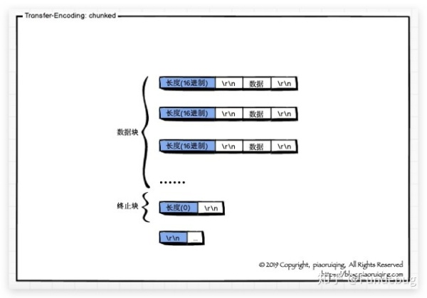

> 但远山长
>
> 云山乱
>
> 晓山青

之前在[http响应报文的长度]([https://bbkgl.github.io/2019/09/27/http响应报文的长度/](https://bbkgl.github.io/2019/09/27/http%E5%93%8D%E5%BA%94%E6%8A%A5%E6%96%87%E7%9A%84%E9%95%BF%E5%BA%A6/))中讲了http响应报文是如何告知客户端他要接收的长度的，其中就讲到了“chunked”编码，那“chunked”编码具体怎么实现长度控制的呢？

首先看一下http的响应头：

```http
HTTP/1.1 200 OK
Bdpagetype: 1
Bdqid: 0x8329f5fd0015bc7c
Cache-Control: private
Connection: Keep-Alive
Content-Type: text/html
Cxy_all: baidu+bb9179976040c4ccb6e0a0874e8067bc
Date: Sun, 06 Oct 2019 14:58:02 GMT
Expires: Sun, 06 Oct 2019 14:57:02 GMT
P3p: CP=" OTI DSP COR IVA OUR IND COM "
Server: BWS/1.1
Set-Cookie: BAIDUID=8B326F960B2A4633073E07FA262961F3:FG=1; expires=Thu, 31-Dec-37 23:55:55 GMT; max-age=2147483647; path=/; domain=.baidu.com
Set-Cookie: BIDUPSID=8B326F960B2A4633073E07FA262961F3; expires=Thu, 31-Dec-37 23:55:55 GMT; max-age=2147483647; path=/; domain=.baidu.com
Set-Cookie: PSTM=1570373882; expires=Thu, 31-Dec-37 23:55:55 GMT; max-age=2147483647; path=/; domain=.baidu.com
Set-Cookie: delPer=0; path=/; domain=.baidu.com
Set-Cookie: BDSVRTM=0; path=/
Set-Cookie: BD_HOME=0; path=/
Set-Cookie: H_PS_PSSID=1440_21124_18559_29523_29721_29568_29220_26350_22159; path=/; domain=.baidu.com
Strict-Transport-Security: max-age=172800
Vary: Accept-Encoding
X-Ua-Compatible: IE=Edge,chrome=1
Transfer-Encoding: chunked
```

注意到在末尾有一个`Transfer-Encoding: chunked`，表示该http报文通过chunked编码控制长度。

接下来看下报文内容：

```http
bd8
<!DOCTYPE html>
<!--STATUS OK-->
...
...
```

`bd8`其实就是接下来的报文段的长度（**十六进制数**），也就是标记后续会发送的报文的长度。

其实就是“分块编码”，一个块发送结束后，会有一个新的十六进制字符串表示接下来的长度。

**那怎么知道是结束呢？**

也就是接收到的这个**十六进制数**是0。

这里有一张图片可以清除地描述整个报文：



注意到`\r\n`的位置！！！

有了这些知识我们就能根据chunked去控制接收长度并及时断开连接防止阻塞了。