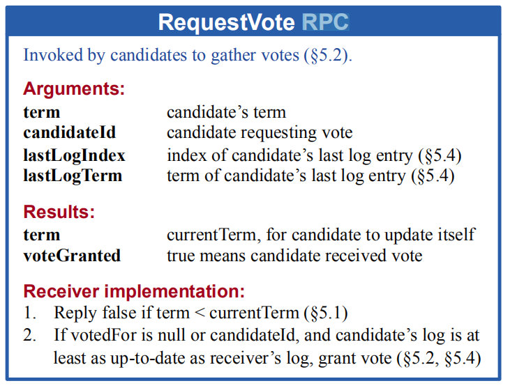
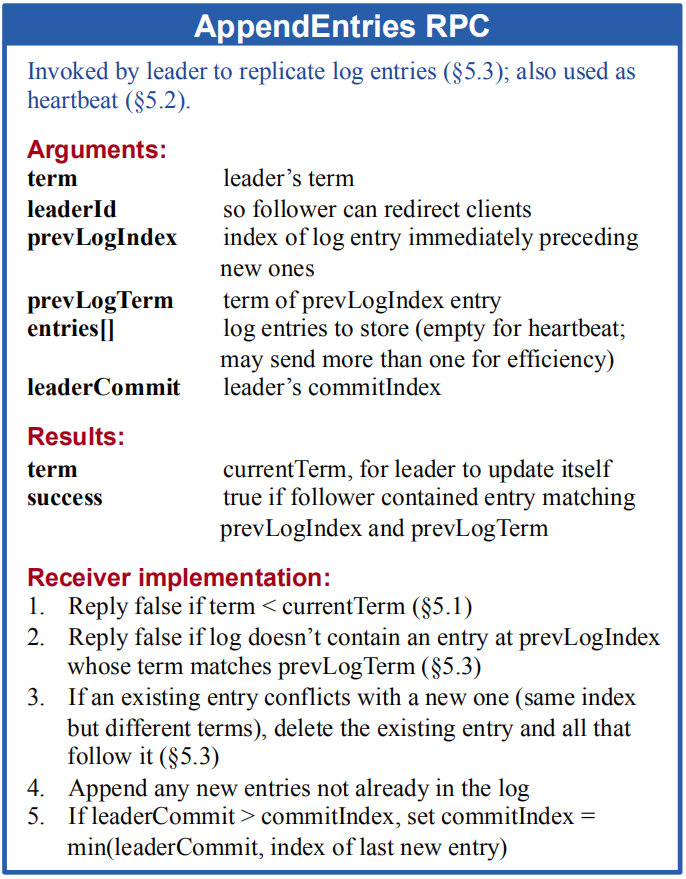

> 韶华不为少年留
>
> 恨悠悠
>
> 几时休

在阅读Raft论文的时候发现其中用到了三种RPC，都是由领导人发出：

- 心跳包RPC，用于维持领导人的权威
- 发送请求投票的 RPC，拉票
- 附加条目 RPC，用于其他服务器的日志复制

其实第一种和第三种是同一类型的RPC，只是在不同情况下作用不一样：当其entries域为空时，该RPC作为Leader的心跳；当entries域不为空时，请求其他节点将entries域中的log添加到自己的log中。

根据论文中的表达，使用的RPC如下：

- RequestVote RPC，拉票RPC
- AppendEntries RPC，日志复制和心跳包RPC

### RequestVote RPC

顾名思义，就是用来拉票的RPC，先来看下论文中对该RPC的图片描述：

候选人远程调用让其他人给自己征集选票，

- 参数：

  - term：候选人的任期号
  - candidateId：候选人的ID，标识，比如主机号及端口号
  - lastLogIndex：候选人最后日志条目的索引值
  - lastLogTerm：候选人最后日志条目的任期号
- 返回值：

  - term：当前任期号，以便于候选人更新自己的任期号
  - voteGranted：候选人赢得了此张选票时为真，即被调用对象是否投票给该候选人
- 接受者要实现：
  - 如果候选人的任期小于当前任期，则返回false（不投票给你）
  - 如果 votedFor 为空或者为 candidateId，并且候选人的日志至少和自己一样新，那么就投票给他，也就是自己还没投给别人，且这个候选人合法的话，就投票给他

### AppendEntries RPC

领导人给其他人复制日志的RPC，也用作任期时心跳，巩固地位。

- 参数
  - term：调用RPC领导人的任期
  - leaderId：领导人的ID，便于群众重定向请求
  - prevLogIndex：新的条目紧随之前的索引值
  - prevLogTerm：prevLogIndex条目对应的任期号
  - entries[]：准备让对方存储的条目，如果是心跳RPC则为空
  - leaderCommit：领导人已经提交日志的索引值
- 返回值
  - term：对应群众节点的当前任期
  - success：如果群众的日志可以和prevLogIndex以及prevLogTerm匹配的话，返回true
- 对应群众节点应该实现的部分
  - 如果领导人的任期小于自己存储的当前任期，返回false
  - 如果本节点日志中不包含prevLogIndex或者日志任期和prevLogTerm不符合，返回false
  - 如果已经存在的日志条目和新的产生冲突（索引值相同但是任期号不同），删除这一条和之后所有的 
  - 附加日志中尚未存在的任何新条目
  - 如果 `leaderCommit > commitIndex`，令 commitIndex 等于 leaderCommit 和 新日志条目索引值中较小的一个

### 总结

这两个RPC都是Raft用来保持一致性的手段，拉票和日志复制。这里的RPC可以理解成一种远程控制，有成功和失败两种状态，也分成以下两种情况讨论：

- 我把我信息都告诉你，你愿不愿意跟我
- 我把我信息都告诉你，你要不要和我同步

以上的”愿不愿意“，都取决于领导人/候选人给的参数和群众自身状态参数的匹配情况。

> 以上内容部分参考[Raft论文中文译文](<https://github.com/maemual/raft-zh_cn/blob/master/raft-zh_cn.md>)

