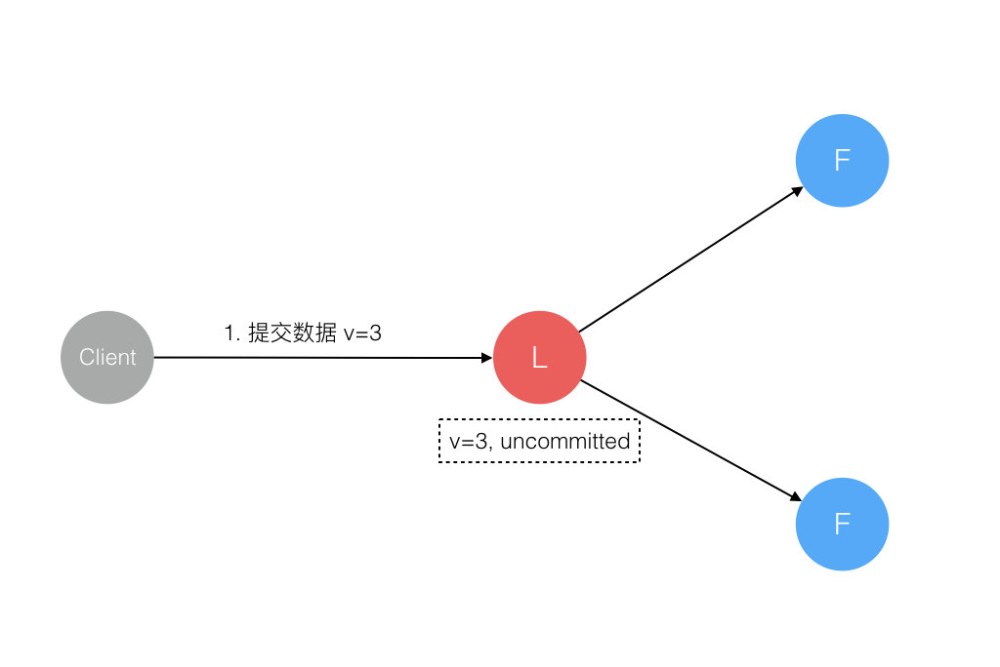

>有水的地方就有人想家
>
>有岸的地方楚歌就四起

## 领导人崩溃

在集群系统中，领导人崩溃可能会造成不一致的情况出现，比如群众可能会丢失一些在新的领导人中有的日志条目，他也可能拥有一些领导人没有的日志条目，或者两者都发生。丢失的情况也是在一般情况下已经可以处理，也就是前面日志复制中说到的直接覆盖，但是第二种情况可能会无法处理。例如，一名群众可能会进入不可用状态同时领导人已经提交了若干的日志条目，然后这名群众可能会被选举为领导人并且覆盖这些日志条目；因此，不同的状态机可能会执行不同的指令序列，这种问题该如何解决呢？答案就是：选举限制。

回到之前的领导人选举，其根据是“随机的选举超时+任期”来限制，现在加上一条：投票人会拒绝掉那些日志没有自己新的投票请求。也就是候选人必须服从以下两个条件才能拿到群众的选票：

- 候选人任期term>=群众任期term
- **候选人日志包含了该群众日志中所有已经提交的日志条目**

这样就正好和之前说到的RequestVote RPC条件以及返回值对应上了。也就是如果这个候选人拿到了大部分选票成为了领导人的话，他的日志至少和大多数的服务器节点一样新，那么他一定持有了所有已经提交的日志条目（此处证明见Raft论文原文5.4.2）。

## 候选人和群众崩溃

候选人和群众崩溃，这种情况处理起来十分简单粗暴，对于领导人来说，心跳包是定时发的，也就是会无限地重试。如果群众或者候选人崩溃了，会收不到领导人的RPC，心跳超时后，领导人会继续发，只要崩溃的机器重启成功，就会接收到这些RPC并补充之前缺失的日志条目。Raft 的 RPCs 都是幂等的，所以这样重试不会造成任何问题。如果一个群众收到了重复的日志，那就会直接忽略这个请求。

## 不同阶段Leader崩溃的一致性论证

#### 1.数据到达Leader节点前

这个阶段，Leader挂掉，不影响。一方面，客户端肯定会超时重新提交数据；另一方面，集群会立即重新选举领导人接收客户端提交的数据。

#### 2.数据到达 Leader 节点，但未复制到 Follower 节点

这个阶段 Leader 挂掉，数据属于未提交状态，Client 不会收到 Ack 会认为超时失败可安全发起重试。Follower 节点上没有该数据，重新选主后 Client 重试重新提交可成功。原来的 Leader 节点恢复后作为 Follower 加入集群重新从当前任期的新 Leader 处同步数据，强制保持和 Leader 数据一致。

#### 3.数据到达 Leader 节点，成功复制到 Follower 所有节点，但还未向 Leader 响应接收

这个阶段 Leader 挂掉，虽然数据在 Follower 节点处于未提交状态（Uncommitted）但保持一致，重新选出 Leader 后可完成数据提交，此时 Client 由于不知到底提交成功没有，可重试提交。针对这种情况 Raft 要求 RPC 请求实现幂等性，也就是要实现内部去重机制。

#### 4.数据到达 Leader 节点，成功复制到 Follower 部分节点，但还未向 Leader 响应接收

这个阶段 Leader 挂掉，数据在 Follower 节点处于未提交状态（Uncommitted）且不一致，Raft 协议要求投票只能投给拥有最新数据的节点。所以拥有最新数据的节点会被选为 Leader 再强制同步数据到 Follower，数据不会丢失并最终一致。

#### 5. 数据到达 Leader 节点，成功复制到 Follower 所有或多数节点，数据在 Leader 处于已提交状态，但在 Follower 处于未提交状态

这个阶段 Leader 挂掉，重新选出新 Leader 后的处理流程和阶段3一样。

#### 6. 数据到达 Leader 节点，成功复制到 Follower 所有或多数节点，数据在所有节点都处于已提交状态，但还未响应 Client

这个阶段 Leader 挂掉，Cluster 内部数据其实已经是一致的，Client 重复重试基于幂等策略对一致性无影响。

#### 7. 网络分区导致的脑裂情况，出现双 Leader

网络分区将原先的 Leader 节点和 Follower 节点分隔开，Follower 收不到 Leader 的心跳将发起选举产生新的 Leader。这时就产生了双 Leader，原先的 Leader 独自在一个区，向它提交数据不可能复制到多数节点所以永远提交不成功。向新的 Leader 提交数据可以提交成功，网络恢复后旧的 Leader 发现集群中有更新任期（Term）的新 Leader 则自动降级为 Follower 并从新 Leader 处同步数据达成集群数据一致。

以上领导人挂掉的7种可能的情况进行了穷举，可以看到Raft都能较好地解决，也就是Raft能够保障领导人节点崩溃的一致性问题。至于候选人和群众崩溃对一致性的影响，前面已经论证过了，这里不再赘述。综上所述，Raft能够较好地保障集群的日志一致性。

## 总结

花了近一个星期，差不多把Raft整体给过了一遍，但是还有部分细节没有去抠，还是做得不够，比如日志压缩。整体而言，相对Paxos，Raft确实在可理解性上花了很大的功夫，最重要的就是强领导人这个特性，把尽可能多的功能集中到了领导人身上，简化了整个算法。明显可以看到的是，Raft在发表后不久，就有了很多种版本的实现，也被应用到了生产场景中，比如etcd。

关于这种算法最好的学习方法，还是自己动手实现一个，大概不久就会有我的实现版本2333。

> 以上内容部分参考[Raft论文中文译文](https://github.com/maemual/raft-zh_cn/blob/master/raft-zh_cn.md)、[Raft 为什么是更易理解的分布式一致性算法](https://www.cnblogs.com/mindwind/p/5231986.html)