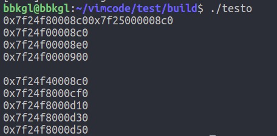

>契阔阻风期
>
>荏苒成雨别

设计模式是一直想要学习一下的知识，这里就从最简单的单例模式开始了，单例模式分为饿汉式和懒汉式。

要求一个类只能生成一个对象，所有对象对它的依赖相同。

## 懒汉式

#### 概念

懒汉式单例就是需要使用这个单例对象的时候才去创建这个单例对象。

#### 实现

使用C++实现：

```cpp
#include <cstdio>
#include <iostream>
#include <thread>
#include <mutex>
#include <unistd.h>
#include <vector>

class Singleton {
public:
    static Singleton *get_instance() {
        if (singleton == nullptr) {
            sleep(1);
            singleton = new Singleton();
        }
        return singleton;
    }
private:
    static Singleton *singleton;
    // 私有的构造函数
    Singleton() {};
};

// 静态变量类内声明，类外定义
Singleton *Singleton::singleton = nullptr;

int main() {
    std::vector<Singleton *> s(10, nullptr);
    for (int i = 0; i < 10; i++) {
        s[i] = Singleton::get_instance();
        std::cout << s[i] << std::endl;
    }    
    return 0;
}
```

这里要注意的是使用static声明singleton和获取实例函数get_instance()。要在不生成对象的情况下使用get_instance()成员函数，需要声明为静态的，同样的要在get_instance()使用的变量也要声明为静态的。

这里看看输出结果：


可以看到实际上只有一个对象生成了。

#### 线程安全

试试用多线程：

```cpp
#include <cstdio>
#include <iostream>
#include <thread>
#include <mutex>
#include <unistd.h>
#include <vector>

class Singleton {
public:
    static Singleton *get_instance() {
        if (singleton == nullptr) {
            sleep(1);
            singleton = new Singleton();
        }
        return singleton;
    }
private:
    static Singleton *singleton;
    // 私有的构造函数
    Singleton() {};
};

// 静态变量类内声明，类外定义
Singleton *Singleton::singleton = nullptr;

void run() {
    Singleton *s = Singleton::get_instance();
    std::cout << s << std::endl;
}

int main() {
    std::vector<std::thread> t(10);
    for (int i = 0; i < 10; i++) 
        t[i] = std::thread(run);
    for (int i = 0; i < 10; i++) 
        t[i].join();
    return 0;
}
```

很明显，出现了线程安全问题，生成了多个对象。



只能加锁了呀，加锁的位置以及原因就不再细说了。

```cpp
#include <cstdio>
#include <iostream>
#include <thread>
#include <mutex>
#include <unistd.h>
#include <vector>

class Singleton {
public:
    static Singleton *get_instance() {
        m.lock();
        if (singleton == nullptr) {
            sleep(1);
            singleton = new Singleton();
        }
        m.unlock();
        return singleton;
    }
private:
    static Singleton *singleton;
    // 私有的构造函数
    Singleton() {};
    static std::mutex m;
};

// 静态变量类内声明，类外定义
Singleton *Singleton::singleton = nullptr;
std::mutex Singleton::m;

void run() {
    Singleton *s = Singleton::get_instance();
    std::cout << s << std::endl;
}

int main() {
    std::vector<std::thread> t(10);
    for (int i = 0; i < 10; i++) 
        t[i] = std::thread(run);
    for (int i = 0; i < 10; i++) 
        t[i].join();
    return 0;
}
```

加锁后，就线程安全了：


## 饿汉式

对比前面的懒汉式，饿汉式就很容易理解了，懒汉式是获取对象时才创建，饿汉式是获取对象前就创建了一个实例。

```cpp
#include <cstdio>
#include <iostream>
#include <thread>
#include <mutex>
#include <unistd.h>
#include <vector>

class Singleton {
public:
    static Singleton *get_instance() {
        return singleton;
    }
private:
    static Singleton *singleton;
    // 私有的构造函数
    Singleton() {};
    static std::mutex m;
};

// 静态变量类内声明，类外定义
Singleton *Singleton::singleton = new Singleton();
std::mutex Singleton::m;

void run() {
    Singleton *s = Singleton::get_instance();
    std::cout << s << std::endl;
}

int main() {
    std::vector<std::thread> t(10);
    for (int i = 0; i < 10; i++) 
        t[i] = std::thread(run);
    for (int i = 0; i < 10; i++) 
        t[i].join();
    return 0;
}
```

这里需要说明的是，虽然构造函数是私有的，但是`Singleton *Singleton::singleton = new Singleton();`是可以成功执行的。因为类的**作用域内访问**，处于Singleton作用域中的地方是可以使用类Singleton中的所有东西.

输出显示只生成了一个对象，且在未加锁的情况下线程安全。

