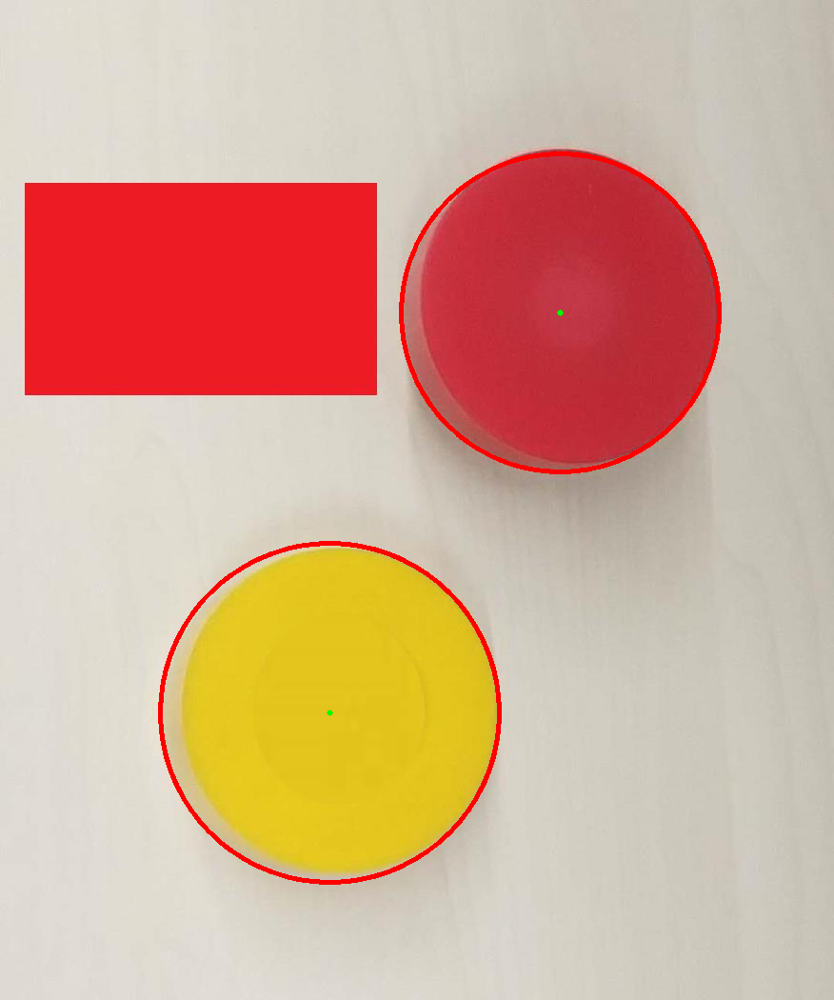
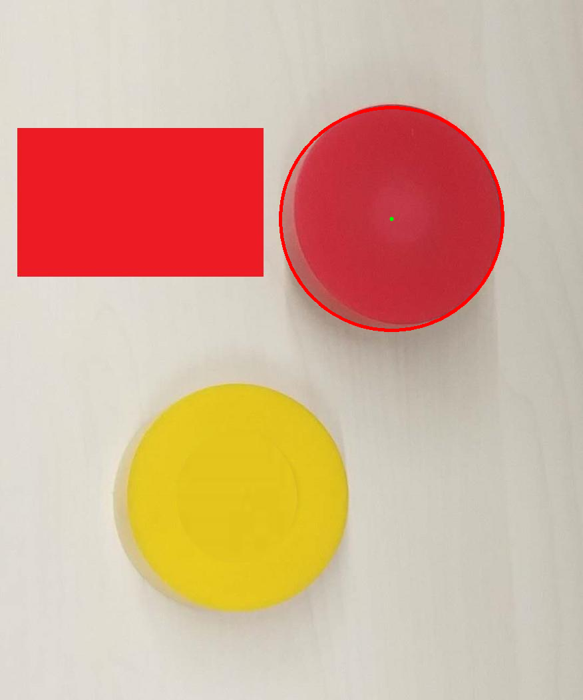

> 四时可爱唯春日
>
> 一事能狂便少年

## 识别圆形零件

识别圆形零件可以用霍夫变换。

#### 霍夫变换

霍夫变换(Hough Transform)是图像处理中的一种特征提取技术，该过程在一个参数空间中通过计算累计结果的局部最大值得到一个符合该特定形状的集合作为霍夫变换结果。

在实际操作时，步骤如下：
1. 得到图像的边缘信息；
2. 对边缘图像中的每一个点，在k-b空间中画出一条直线；
3. 对各直线上的点，我们采取“投票”（vote）的方法，即累加：有直线经过这一点，这一点的值加1；
4. 遍历k-b空间，找出局部极大值点，这些点的坐标（k，b）就是原图像中可能的直线的斜率和截距。

#### 霍夫变换识别圆

Hough变换可以检测任意的已知表达形式的曲线，关键是看其参数空间的选择，参数空间的选择可以根据它的表达形式而定。比如圆的表达形式为，所以当检测某一半径的圆的时候，可以选择与原图像空间同样的空间作为参数空间。那么圆图像空间中的一个圆对应了参数空间中的一个点，参数空间中的一个点对应了图像空间中的一个圆，圆图像空间中在同一个圆上的点，它们的参数相同即a，b相同，那么它们在参数空间中的对应的圆就会过同一个点（a，b），所以，将原图像空间中的所有点变换到参数空间后，根据参数空间中点的聚集程度就可以判断出图像空间中有没有近似于圆的图形。如果有的话，这个参数就是圆的参数。

对于圆的半径未知的情况下，可以看作是有三个参数的圆的检测，中心和半径。这个时候原理仍然相同，只是参数空间的维数升高，计算量增大。图像空间中的任意一个点都对应了参数空间中的一簇圆曲线。 ，其实是一个圆锥型。参数空间中的任意一个点对应了图像空间中的一个圆。

#### 作业实现

作业给的是如下一张图片：


很明显这里要检测出红色和黄色的圆，而红色的矩形明显是后期加的干扰元素。

这里使用opencv提供的`cv::HoughCircles()`函数实现，C++代码实现如下：

```cpp
#include <iostream>
#include <opencv2/opencv.hpp>
#include <vector>

int main() {
    cv::Mat src_img = cv::imread("../src.png"), tmp_img, dst_img;
    dst_img = src_img;
    cv::cvtColor(src_img, tmp_img, cv::COLOR_BGR2GRAY);
    cv::medianBlur(tmp_img, tmp_img, 3);
    std::vector<cv::Vec3f> circles;
    cv::HoughCircles(tmp_img, circles, cv::HOUGH_GRADIENT, 1, tmp_img.rows/5, 60, 30, 0, 0);
    for (size_t i = 0; i < circles.size(); i++) {
        // 提取圆心
        cv::Point center(cvRound(circles[i][0]), cvRound(circles[i][1]));
        // 提取半径
        int radius = cvRound(circles[i][2]);
        // 绘制圆心
        circle(dst_img, center, 3, cv::Scalar(0, 255,0), -1, 8, 0 );
        // 绘制圆
        circle(dst_img, center, radius, cv::Scalar(0,0,255), 3, 8, 0 );
    }
    cv::imwrite("../dst.png", dst_img);
    return 0;
}
```

整体来说分以下几步：

1. 读取图片，转换成灰度图
2. 进行中值滤波（为什么使用中值滤波？）
   - 根据第二次作业我们可以看到中值滤波可以保留更多的信息，特别是边缘信息，这对边缘检测很重要
   - 相对来说，高斯滤波和均值滤波都会损失很多信息，图像整体会模糊
3. 使用霍夫变换检测圆，得到若干个圆的圆心和半径
4. 根据圆心和半径在原来的图形上绘制出圆，并保存

#### 效果展示

通过几番折腾，改滤波，改参数，成功找出了两个圆形：



## 识别红色的圆形零件

有了作业一的基础，就很好完成了。

#### 实现

作业一已经能够识别出圆了，现在只要修改使得其只标记出红色圆就行了。可以直接判断圆心的G通道是否小于100，因为这种黄色的G通道必然大于150，而对应红色的G通道就会小于100。

C++代码如下：

```cpp
#include <iostream>
#include <opencv2/opencv.hpp>
#include <vector>

// BGR
// 黄色：28 196 227
// 红色：70 55 193

// 黄色的G通道必然大于100
bool judge(const cv::Mat src_img, cv::Point pt) {
    cv::Vec3b v = src_img.at<cv::Vec3b>(pt);
    if (v.val[1] > 100)
        return false;
    else return true;
}

int main() {
    cv::Mat src_img = cv::imread("../src.png"), tmp_img, dst_img;
    dst_img = src_img;
    cv::cvtColor(src_img, tmp_img, cv::COLOR_BGR2GRAY);
    cv::medianBlur(tmp_img, tmp_img, 3);
    std::vector<cv::Vec3f> circles;
    cv::HoughCircles(tmp_img, circles, cv::HOUGH_GRADIENT, 1, tmp_img.rows/5, 60, 30, 0, 0);
    for (size_t i = 0; i < circles.size(); i++) {
        // 提取圆心
        cv::Point center(cvRound(circles[i][0]), cvRound(circles[i][1]));
        // 提取半径
        int radius = cvRound(circles[i][2]);
        if (judge(src_img, center)) {
            // 绘制圆心
            circle(dst_img, center, 3, cv::Scalar(0, 255,0), -1, 8, 0 );
            // 绘制圆
            circle(dst_img, center, radius, cv::Scalar(0,0,255), 3, 8, 0 );
        }
    }
    cv::imwrite("../dst_2.png", dst_img);
    return 0;
}
```

#### 效果

可以看到下图只圈出了红色的零件。


