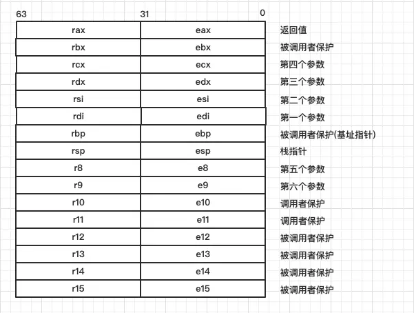

> 东风夜放花千树
>
>更吹落
>
>星如雨 

获取一个已经在运行的C++进程的函数堆栈信息之前已经讲过了，然后就会想到，怎么获取到对应函数的参数值呢？

这是一个不简单的问题，前面讲过了函数压栈的问题，这次讲一下寄存器。

## 函数参数传递

#### 程序寄存器

在X64计算机上，有多个寄存器，这些寄存器都用来保存函数调用时的临时信息，还有很重要的一点，**寄存器是所有函数调用过程中共享的存储资源**。

比如之前说到的RBP，RSP寄存器，是存储函数栈帧边界地址的。还有很多其他寄存器，可以见下图：



e打头表示是在32位机器上，现在 x86-64中，所有寄存器都是64位，寄存器名字都是r打头，但是同样兼容e打头的标识符用法。

函数参数寄存器就是上图说的6个参数寄存器，什么时候用到这些参数寄存器呢？

再来回顾一下函数压栈过程：

1. 调用者函数把被调函数的参数从右向左依次压入栈;
2. 调用者函数使用call指令调用被调函数,并把call指令的下一条指令的地址当成返回地址压入栈中(这个压栈操作隐含在call指令中);
3. 在被调函数中,被调函数会先保存调用者函数的栈底地址(push rbp),然后再保存调用者函数的栈顶地址,即:当前被调函数的栈底地址(mov rbp,rsp);
4. 在被调函数中,从rbp的位置处开始存放被调函数中的局部变量和临时变量,并且这些变量的地址按照定义时的顺序依次减小,即:这些变量的地址是按照栈的延伸方向排列的,先定义的变量先入栈,后定义的变量后入栈;

在过程1中把函数实参压栈的时候就会将参数保存在寄存器中，也就是说这些寄存器记录的之前的信息会被覆盖掉，然后在执行某个函数时，会把寄存器中的函数参数取出，在栈帧中保存。

#### 使用GDB查看函数调用过程

我们先给上示例程序，很简单的示例程序：

```cpp
#include <cstdio>
#include <unistd.h>

void aaaaaaaaaa(int a, int b, int c, int d) {
    int e = 14;
    printf("a(%d):%x, sizeof(&a) == %d, b:%x, sizeof(&b) == %d\n", a, &a, sizeof &a, &b, sizeof &b);
    printf("c = %d, addr = %x  d = %d, addr = %x\n", c, &c, d, &d);
    sleep(100000);
}

int main() {
    int a = 10;
    aaaaaaaaaa(a, 11, 12, 13);
    return 0;
}
```

使用gdb分别将两个函数转成汇编语句：

```shell
gdb <appname>
disassemble /m main   # 查看main函数的汇编执行过程
```

**得到main函数的汇编语句**：

```assembly
(gdb) disassemble /m main
Dump of assembler code for function main():
17      int main() {
   0x0000000000000798 <+0>:     push   %rbp
   0x0000000000000799 <+1>:     mov    %rsp,%rbp
   0x000000000000079c <+4>:     sub    $0x10,%rsp

18          int a = 10;
   0x00000000000007a0 <+8>:     movl   $0xa,-0x4(%rbp)

19          aaaaaaaaaa(a, 11, 12, 13);
   0x00000000000007a7 <+15>:    mov    -0x4(%rbp),%eax
   0x00000000000007aa <+18>:    mov    $0xd,%ecx
   0x00000000000007af <+23>:    mov    $0xc,%edx
   0x00000000000007b4 <+28>:    mov    $0xb,%esi
   0x00000000000007b9 <+33>:    mov    %eax,%edi
   0x00000000000007bb <+35>:    callq  0x720 <aaaaaaaaaa(int, int, int, int)>

20          return 0;
   0x00000000000007c0 <+40>:    mov    $0x0,%eax

21      }   0x00000000000007c5 <+45>:   leaveq 
   0x00000000000007c6 <+46>:    retq   

End of assembler dump.
```

重点关注到调用`aaaaaaaaaa`函数的过程：

```assembly
0x00000000000007a0 <+8>:     movl   $0xa,-0x4(%rbp)  
0x00000000000007a7 <+15>:    mov    -0x4(%rbp),%eax
0x00000000000007aa <+18>:    mov    $0xd,%ecx
0x00000000000007af <+23>:    mov    $0xc,%edx
0x00000000000007b4 <+28>:    mov    $0xb,%esi
0x00000000000007b9 <+33>:    mov    %eax,%edi
0x00000000000007bb <+35>:    callq  0x720 <aaaaaaaaaa(int, int, int, int)>
```

解释一下：

- 将局部变量a放到rbp-4的位置
- 将局部变量a拷贝到eax寄存器中
- 将值10（对应形参d）拷贝到ecx寄存器中
- 将值11（对应形参c）拷贝到edx寄存器中
- 将值12（对应形参b）拷贝到esi寄存器中
- 将局部变量a拷贝到edi寄存器中
- 然后调用`aaaaaaaaaa`函数

这也是说明函数确实是从右到左进栈的，但不一定进栈，应该先进入寄存器。

然后是`aaaaaaaaaa`函数


```shell
disassemble /m aaaaaaaaaa   # 查看main函数的汇编执行过程
```

**得到main函数的汇编语句**：

```assembly
(gdb) disassemble /m aaaaaaaaaa
Dump of assembler code for function aaaaaaaaaa(int, int, int, int):
10      void aaaaaaaaaa(int a, int b, int c, int d) {
   0x0000000000000720 <+0>:     push   %rbp
   0x0000000000000721 <+1>:     mov    %rsp,%rbp
   0x0000000000000724 <+4>:     sub    $0x20,%rsp
   0x0000000000000728 <+8>:     mov    %edi,-0x14(%rbp)
   0x000000000000072b <+11>:    mov    %esi,-0x18(%rbp)
   0x000000000000072e <+14>:    mov    %edx,-0x1c(%rbp)
   0x0000000000000731 <+17>:    mov    %ecx,-0x20(%rbp)

11          int e = 14;
   0x0000000000000734 <+20>:    movl   $0xe,-0x4(%rbp)
```

这里只截取前一部分，以便于观察参数是如何进栈的。

我们依旧解释上述汇编过程：

- 前两句依旧是建立新栈帧
- 然后是让rsp寄存器存储栈顶地址
- 接下来四句就是形参入栈了：
  - rbp-14存储第一个参数
  - rbp-18存储第二个参数
  - rbp-1c存储第三个参数
  - rbp-20存储第四个参数
- 然后是创建局部变量，注意这里重点是局部变量在形参前面

上述中重点就是栈帧中**局部变量在形参前面**。

也就是这么个结构：

```cpp
rbp
局部变量
空12字节
形参
rsp
```

于是我们就可以明白，获取函数某个参数，需要去计算在rbp上偏移多少个单位。

这里还有个疑问，为什么不能直接用存储形参的那几个寄存器来获取呢？

如果我们同时把`main`和`aaaaaaaaaa`放一起观察，就会发现rdi、rsi等几个寄存器是不断在存储新的值的，如果用gdb每次进入新的栈帧去观察这些寄存器的值，会发现rdi和rsi等参数寄存器中存储的永远是顶层栈的信息，而rsp和rbp存储的就是每个栈帧的信息。

所以，如果我们不在调用某个函数的时候要得到该函数的参数，通过这几个参数寄存器显然是不行的，除非在这之前，就已经存储了这些寄存器的值，比如gdb就是这么做的。

