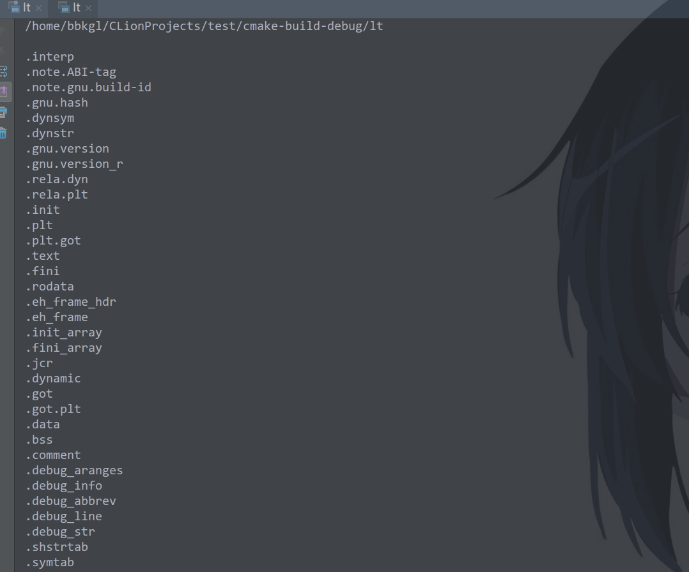
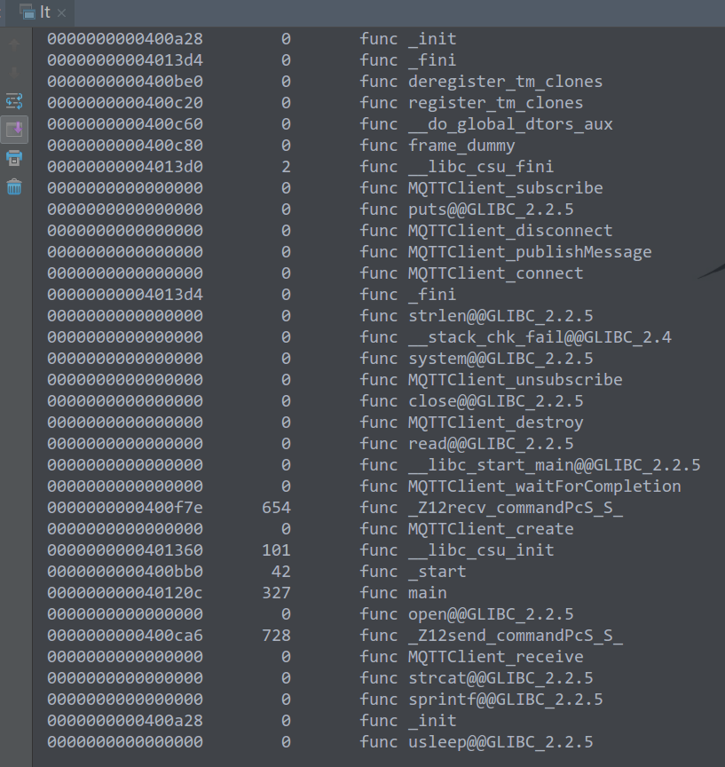
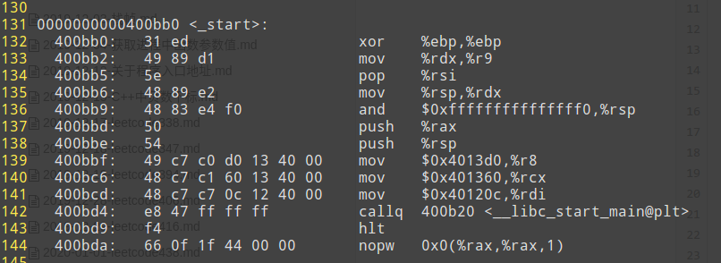
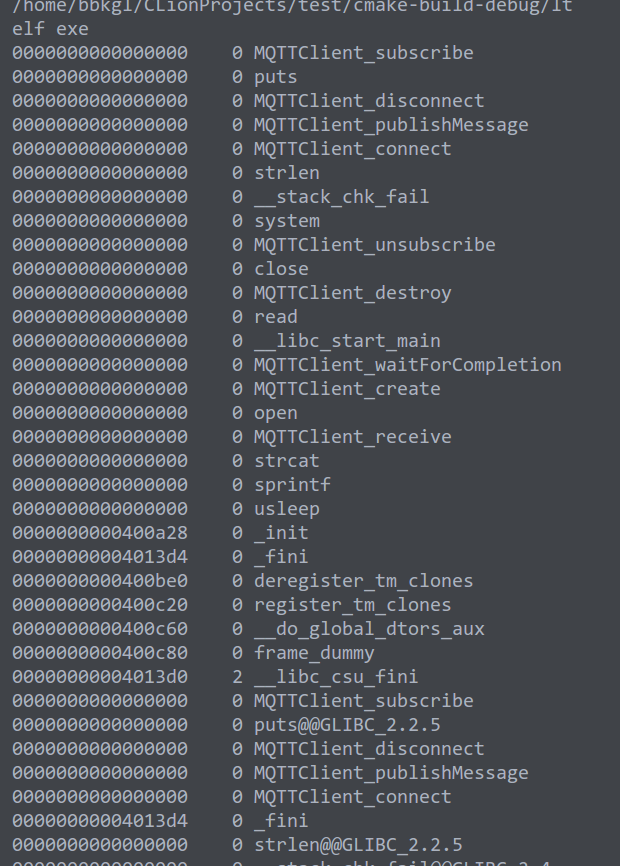
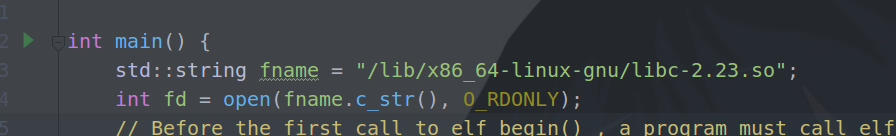
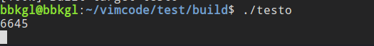
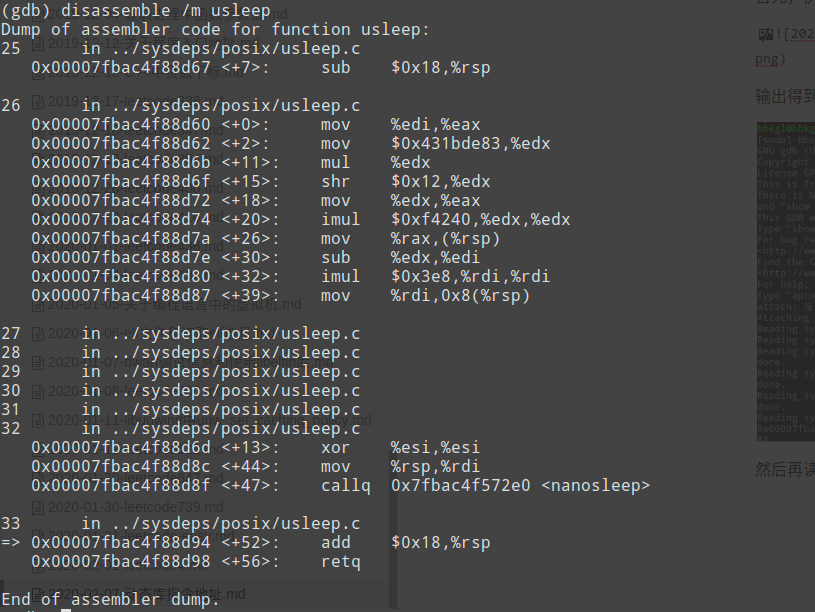
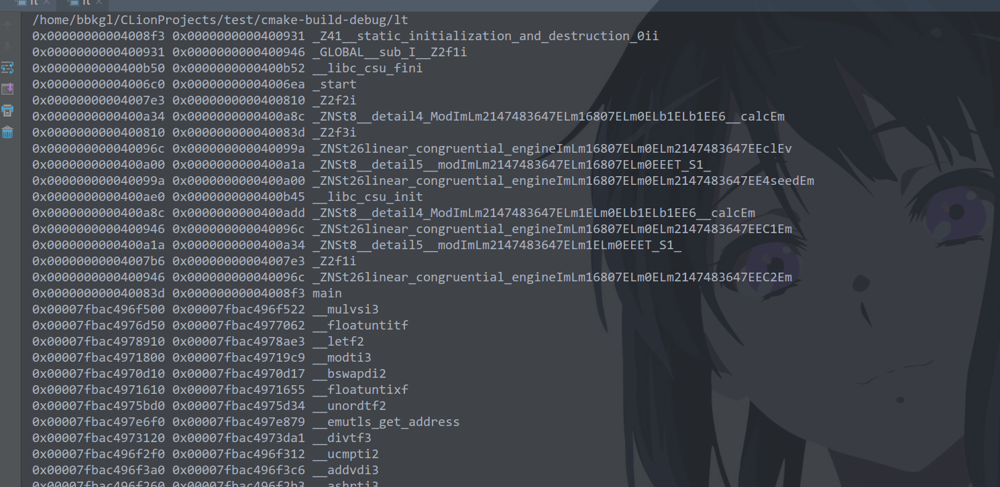
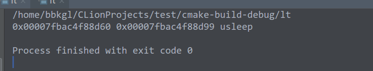

>为众人抱薪者
>
>已冻毙于风雪

## 获取可执行文件的符号表

获取可执行文件的符号表其实还是比较简单的，直接用libelfin的接口读取就行了，当然也可以用libelf库，也不是很难，这里我都会演示一下的，并和readelf读取的进行对比。

#### 使用libelfin读取符号表

libelfin的接口设计很人性化，为什么这么说呢？两个原因。

- 现代C++11写的，比较简洁，考虑的东西少很多
- 门槛低，不需要了解太多关于elf/dwarf符号的的知识应该就能用
- libelf库不好找相关的例子，也没有比较好的文档。。。反正我没找到

等会看看用libelf库实现同样的功能多麻烦，就发现libelfin的好了。

首先可以遍历elf文件中的各个段：

```cpp
#include <iostream>
#include <vector>
#include <algorithm>
#include <climits>
#include <elf/elf++.hh>
#include <string>
#include <fcntl.h>
#include <unistd.h>

int main() {
    std::string fname = "/home/bbkgl/vimcode/server";
    int fd = open(fname.c_str(), O_RDONLY);
    elf::elf ef(elf::create_mmap_loader(fd));
    for (const auto &sec : ef.sections()) { 
        printf("Symbol table '%s':\n", sec.get_name().c_str());
    }
    close(fd);
    return 0;
}
```

看一下输出：



可以看到程序的各个段，也有我们熟知的`text`、`data`、`bss`段，也有我们后面要用的符号段：`.symtab`、`.dynamic`，也就是符号表。

所以得从这两个section中读取符号，同样使用libelfin库，接着上面的程序写。

稍微加上几行就好了，但是注意这里我进行了筛选，得到只有函数的符号，并使用重载的`elf::to_string()`去打印符号类型，筛选后应该都是`func`。

```cpp
#include <iostream>
#include <vector>
#include <algorithm>
#include <climits>
#include <elf/elf++.hh>
#include <string>
#include <unistd.h>
#include <fcntl.h>

int main() {
    std::string fname = "/home/bbkgl/vimcode/server";
    int fd = open(fname.c_str(), O_RDONLY);
    elf::elf ef(elf::create_mmap_loader(fd));
    for (const auto &sec : ef.sections()) {
        if (sec.get_hdr().type != elf::sht::symtab && sec.get_hdr().type != elf::sht::dynsym)
            continue;
        for (const auto &sym : sec.as_symtab()) {
            auto &data = sym.get_data();
            if (data.type() != elf::stt::func) continue;
            printf("%016lx %8ld %10s %s\n", data.value, data.size,
                   elf::to_string(data.type()).c_str(), sym.get_name().c_str());
        }
    }
    close(fd);
    return 0;
}
```

看到输出结果：



可以看到所有函数符号都打印出来了，还打印了函数的起始指令地址和函数的指令在函数中所有指令地址上的范围，这里可以说明一下，直接看汇编会更清楚一点，这里以_start函数举例。

使用`objdump -d server > server.txt`拿到汇编指令，然后打开`server.txt`，找到_start函数的指令。



在之前图中可以看到，_start函数的起始指令地址为`0x0000000000400bb0`，地址范围大小为42，`0x400bb0 + 42 = 0x400bda`，正好就是最后一条指令，所以打印的符号表中的意义就很明了了。

当然也会发现有很多函数的起始指令地址是0，地址范围大小也是0，说明这些函数是动态库中导入的，后面会详细说如何获取这部分函数的符号表。

#### 使用libelf库读取符号表

其实原理和步骤其实是一样的，只是用libelf库相对来说会复杂很多。

然后我就直接贴代码了，注意的是libelf会依赖于libz：

```cpp
#include <iostream>
#include <vector>
#include <algorithm>
#include <climits>
#include <elf/elf++.hh>
#include <string>
#include <fcntl.h>
#include <libelf.h>
#include <unistd.h>
#include <gelf.h>

int main() {
    std::string fname = "/home/bbkgl/vimcode/server";
    int fd = open(fname.c_str(), O_RDONLY);
    // Before the first call to elf_begin() , a program must call elf_version() to coordinate versions.
    if (elf_version(EV_CURRENT) == EV_NONE) {
        printf("EV_NONE");
    }

    Elf *elf = elf_begin(fd, ELF_C_READ_MMAP, nullptr);
    if (elf != nullptr) {
        /* 确定是文件类型是否是ELF文件 */
        if (elf_kind (elf) == ELF_K_ELF) {
            printf("elf exe\n");
        } else if (elf_kind (elf) == ELF_K_AR) { /* 目标是库文件 */
            printf("lib\n");
        }
        Elf_Scn     *scn = nullptr;
        GElf_Shdr   shdr;
        Elf_Data    *data;
        int         ii, count;
        while ((scn = elf_nextscn(elf, scn)) != nullptr) {
            gelf_getshdr(scn, &shdr);
            if (shdr.sh_type == SHT_SYMTAB || shdr.sh_type == SHT_DYNSYM) {
                data = elf_getdata(scn, nullptr);
                count = shdr.sh_size / shdr.sh_entsize;
                // sym.st_info == 18的时候是func类型
                for (ii = 0; ii < count; ++ii) {
                    GElf_Sym sym;
                    gelf_getsym(data, ii, &sym);
                    // 只打印函数符号表
                    if (ELF32_ST_TYPE(sym.st_info) != STT_FUNC) continue;
                    char *name = nullptr;
                    int status = 99;
                    printf("%016lx %4d %s\n", sym.st_value, sym.st_size, elf_strptr(elf, shdr.sh_link, sym.st_name));
                }
            }
        }
        /* 关闭elf结构句柄 */
        elf_end (elf);
    }
    close(fd);
    return 0;
}
```

下面是输出结果，其实和之前libelfin差不多，但是代码长度长了一半多啊，：



## 获取可执行文件引入的动态库的符号表

在前面已经看到，存在某个函数符号的首指令地址和地址范围都为0，表示这个函数其实是动态库内的函数，那么在哪里可以得到这些动态库里的函数以及指令地址呢？

#### 动态库的地址映射/proc/[pid]/maps文件

在/proc/[pid]/maps文件中存放有每个进程的地址映射关系，同样包括了这些动态库文件目录，以及映射到elf文件里的地址范围里。

同样的，以server这个程序为例，我们查看它的地址映射文件：


可以注意到，在后面，会有很多动态库.so出现，这里稍微解释一下，只对我比较清楚的项作解释，会看到几乎每个.so文件都对应了4行，或者也有3行的，每一行内容空格作为分隔：

```cpp
首地址-尾地址 权限 地址偏移 时间 不知道 动态库目录
```

对于我们来说，关注的是`首地址-尾地址 权限 动态库目录`，为什么会出现三-四行呢，因为动态库同样也分为数据段，代码段等，不同的段映射的地址不一样，我们要关注的是代码段：

- `首地址-尾地址`是对应的动态库这部分在可执行文件里的实际地址范围
- 权限就是可读可写可执行，p我不知道干嘛的，如果可执行，说明这就是代码段，是我们关注的段
- 动态库目录，就是这个动态库文件实际在这个机器上什么位置

于是理论就理清楚了，可以先尝试以下读取动态库的符号表。

#### 读取动态库符号表

可以直接使用之前的程序，把文件路径改成动态库的路径：



然后输出，其实是一样的，不过这次会发现部分熟悉的函数，比如sleep、usleep，就是glibc库中的，还有就是前前面的首指令其实是个相对地址，相对动态库载入首地址的相对地址，后面会讲换算。


#### 动态库相对地址换算成绝对地址

换算其实很简单，就是`函数指令地址范围+动态库载入首地址`就可以了，这个也是基于前面的理论，这里会以usleep函数作为例子，因为usleep函数其实是glibc库中的函数。

先给出被读取的程序，test.cpp，打包成可执行文件test：

```cpp
#include <cstdio>
#include <iostream>
#include <unistd.h>
#include <random>

using namespace std;

void f3(int);

void f1(int n) {
    if (n == 0) {
        printf("%d\n", getpid());
        usleep(10 * 1000);
    } else f1(n - 1);
}

void f2(int n) {
    if (n == 0) {
        usleep(10 * 1000);
    } else f3(n - 1);
}

void f3(int n) {
    if (n == 0) {
        usleep(10 * 1000);
    } else f2(n - 1);
}

int main() {
    std::default_random_engine e;
    while (true) {
        int rd = e();
        if (rd % 3 == 0)
            f1(2);
        else if (rd % 3 == 1)
            f2(2);
        else
            f3(2);
    }
    return 0;
}
```

说明步骤：

- 执行`./test`，其大部分时间会停留在usleep上
- 使用gdb attach上去，`./test`会执行在usleep里，这样的话，可以通过gdb打印出汇编指令，能看到usleep的首指令地址
- 使用自己编写读取所有elf符号（包括动态库.so）的程序读取`test`可执行文件的所有符号表，并换算其中动态库中所有函数的地址范围为绝对地址

首先，执行`./test`：



输出得到进程id，使用gdb attach上去`gdb attach 6645`：


然后再读取usleep的汇编：



可以看到`0x00007fbac4f88d60 <+0>:	mov    %edi,%eax`这一行，可以看到`0x00007fbac4f88d60`就是usleep函数的首指令地址，后面需要将这个地址作为验证。

最后写程序读取elf符号表，包括动态库的，会比较麻烦，要解析maps文件，如果是python就简单了，C++就是会写的长一些：

```cpp
#include <iostream>
#include <vector>
#include <algorithm>
#include <fstream>
#include <climits>
#include <elf/elf++.hh>
#include <string>
#include <fcntl.h>
#include <libelf.h>
#include <unistd.h>
#include <gelf.h>

struct FuncSym {
    uintptr_t low;
    uintptr_t high;
    std::string name;

    FuncSym(uintptr_t l, uintptr_t h, std::string sname) :
            low(l), high(h), name(sname) {}
};

void getsymbol(std::string fname, std::vector<FuncSym> &symbols, uintptr_t low = 0) {
    int fd = open(fname.c_str(), O_RDONLY);
    elf::elf ef(elf::create_mmap_loader(fd));
    for (const auto &sec : ef.sections()) {
        if (sec.get_hdr().type != elf::sht::symtab && sec.get_hdr().type != elf::sht::dynsym)
            continue;
        for (const auto &sym : sec.as_symtab()) {
            auto &data = sym.get_data();
            if (data.type() != elf::stt::func) continue;
            if (data.size && data.value)
                symbols.emplace_back(low + data.value, low + data.value + data.size, sym.get_name());
        }
    }
    close(fd);
}

std::string splitbyspace(char *&line) {
    if (strlen(line) <= 0) return std::string();
    char *p = line;
    while (*p != ' ' && *p) {
        p++;
    }
    std::string ret(line, p);
    while (*p == ' ') p++;
    line = p;
    return ret;
}

int main() {
    pid_t pid = 6645;
    std::string fexename = "/proc/" + std::to_string(pid) + "/exe";
    std::string fmapsname = "/proc/" + std::to_string(pid) + "/maps";
    std::vector<FuncSym> symbols;
    getsymbol(fexename, symbols);
    // 解析maps，把所有动态库的代码段地址范围和动态库目录获取到，并依次获取其符号表并转换
    std::ifstream streammaps(fmapsname);
    while (!streammaps.eof()) {
        std::string str;
        char line[200];
        streammaps.getline(line, 200);
        char *newline = line;
        str = splitbyspace(newline);
        uintptr_t mid = str.find('-');
        uintptr_t low = (uintptr_t)(strtol(str.substr(0, mid).c_str(), nullptr, 16));
        str = splitbyspace(newline);
        bool codesec = (str.find('x') != std::string::npos);
        str = splitbyspace(newline);
        str = splitbyspace(newline);
        str = splitbyspace(newline);
        str = splitbyspace(newline);
        if (codesec && str.find(".so") != std::string::npos) {
            getsymbol(str, symbols, low);
        }
    }
    for (const auto &sym : symbols) {
        printf("0x%016lx 0x%016lx %s\n", sym.low, sym.high, sym.name.c_str());
    }
    return 0;
}
```

然后打印一下，就可以获取到所有的符号表了就，包括动态库的：



同时，筛选出usleep函数的符号和首位指令地址：

```cpp
for (const auto &sym : symbols) {
    if (sym.name.find("usleep") != std::string::npos) {
        printf("0x%016lx 0x%016lx %s\n", sym.low, sym.high, sym.name.c_str());
    }
}
```

然后打印结果：



看到了，首指令地址就是`0x00007fbac4f88d60`，和之前gdb里面汇编打印的一样。。。

大功告成！