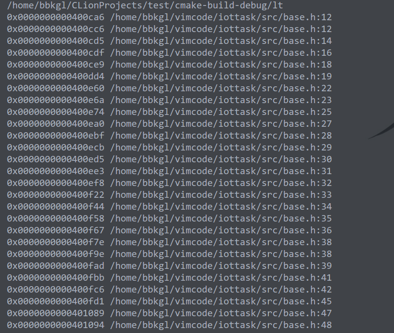

>金杯侧
>
>插向绿云鬓
>
>便随王母仙

在之前的一篇博客[elf文件和读取elf信息](<https://bbkgl.github.io/2020/01/06/elf%E6%96%87%E4%BB%B6%E5%92%8C%E8%AF%BB%E5%8F%96elf%E4%BF%A1%E6%81%AF/>)中已经讲到，elf文件中的.debug_line段，存储的是汇编指令地址到文件名+行号的映射。

dwarf是一种调试格式，可以通过解析这种格式获得很多的调试信息，这里的汇编指令对应的源代码位置就是一种调试信息。

其实能够介绍的不是很多，关于dwarf，读者可以自行百度/谷歌查询，也可以直接查看官方文档[DWARF调试格式介绍](http://www.dwarfstd.org/doc/Debugging%20using%20DWARF-2012.pdf)。

```cpp
#include <iostream>
#include <vector>
#include <algorithm>
#include <fstream>
#include <climits>
#include <elf/elf++.hh>
#include <string>
#include <fcntl.h>
#include <libelf.h>
#include <unistd.h>
#include <gelf.h>
#include <dwarf/dwarf++.hh>

void dump_line_table(const dwarf::line_table &lt) {
    for (const dwarf::line_table::entry &line : lt) {
        if (line.end_sequence)
            printf("\n");
        else {
            printf("0x%016lx %s:%d\n", line.address, line.file->path.c_str(), line.line);
        }
    }
}


void getline(std::string fname) {
    int fd = open(fname.c_str(), O_RDONLY);
    elf::elf ef(elf::create_mmap_loader(fd));
    dwarf::dwarf dw(dwarf::elf::create_loader(ef));
    for (const auto &cu : dw.compilation_units()) {
        dump_line_table(cu.get_line_table());
    }
    close(fd);
}


int main() {
    std::string fexename = "/home/bbkgl/vimcode/server";
    getline(fexename);
    return 0;
}
```

看看效果图：

