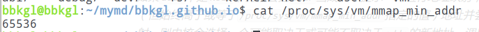

> 晚泊孤舟古祠下
>
> 满川风雨看潮生

简单介绍下相关背景，luajit2.05及以下版本在设计的时候就使用的相关手段，使得luajit中各种变量的内存地址被限制在了1-2GB的范围里，所以实际上其使用的空间也不会超过2GB。


这个在stackoverflow上也有相关的[问题](<https://stackoverflow.com/questions/35155444/why-is-luajits-memory-limited-to-1-2-gb-on-64-bit-platforms>)，然后下面的解答是这样的：


大概意思就是说，在x64的平台上，luajit中通过在`mmap`函数中使用`MAP_32BIT`标志位来限制申请的地址范围只会在最低的2GB里，实际上该标志位不是限制在32位内存里，而是限制在31位里，可以查看 [这里](http://timetobleed.com/digging-out-the-craziest-bug-you-never-heard-about-from-2008-a-linux-threading-regression/) 有详细的介绍和说明。

如果使用的内存地址范围大于1GB，Luajit的作者解释了为什么这个对性能不好：

- 完整的GC会比分配多花费50%的时间
- 如果GC可用，将会是分配的2倍时间
- 为了模拟真实的应用程序，对象之间的链接在第三轮中被随机化。 这使GC时间加倍！

我也看得有点懵逼，大概意思就是使用更多的空间会使得GC的时间变得很长。

所以引出两个问题：

- luajit是怎么做到限制内存使用范围的
- 本身因为luajit2.05及以下版本中很多指针和地址变量都是32位的，不可能超过4GB。那如果解除这种限制呢？让他在3GB-4GB的范围里

实际上回答里有提到，可以使用luajit2.1，是64位的，不存在这个问题，但很多项目里本身用的是2.05，而且现在不能保证2.1是稳定的，所以解决这个问题就有必要了。

## luajit是如果限制范围的呢？

简单介绍下luajit的内存布局，实际上luajit用`TValue`表示了几乎所有的类型，而`TValue`所在的地址空间，就是使用一个函数进行分配的。

```cpp
LUALIB_API lua_State *luaL_newstate(void)
{
  lua_State *L;
  void *ud = lj_alloc_create();
  if (ud == NULL) return NULL;
#if LJ_64
  L = lj_state_newstate(lj_alloc_f, ud);
#else
  L = lua_newstate(lj_alloc_f, ud);
#endif
  if (L) G(L)->panic = panic;
  return L;
}
```

这个函数就是`lj_alloc_create`：

```cpp
#ifndef _LJ_ALLOC_H
#define _LJ_ALLOC_H

#include "lj_def.h"

#ifndef LUAJIT_USE_SYSMALLOC
LJ_FUNC void *lj_alloc_create(void);
LJ_FUNC void lj_alloc_destroy(void *msp);
LJ_FUNC void *lj_alloc_f(void *msp, void *ptr, size_t osize, size_t nsize);
#endif

#endif
```

```cpp
void *lj_alloc_create(void)
{
  size_t tsize = DEFAULT_GRANULARITY;
  char *tbase;
  INIT_MMAP();
  tbase = (char *)(CALL_MMAP(tsize));
  if (tbase != CMFAIL) {
    size_t msize = pad_request(sizeof(struct malloc_state));
    mchunkptr mn;
    mchunkptr msp = align_as_chunk(tbase);
    mstate m = (mstate)(chunk2mem(msp));
    memset(m, 0, msize);
    msp->head = (msize|PINUSE_BIT|CINUSE_BIT);
    m->seg.base = tbase;
    m->seg.size = tsize;
    m->release_checks = MAX_RELEASE_CHECK_RATE;
    init_bins(m);
    mn = next_chunk(mem2chunk(m));
    init_top(m, mn, (size_t)((tbase + tsize) - (char *)mn) - TOP_FOOT_SIZE);
    return m;
  }
  return NULL;
}
```

实际上`lj_alloc_create`调用的是函数`CALL_MMAP`来分配内存：

```cpp
static LJ_AINLINE void *CALL_MMAP(size_t size)
{
  int olderr = errno;
  void *ptr = mmap((void *)MMAP_REGION_START, size, MMAP_PROT, MAP_32BIT|MMAP_FLAGS, -1, 0);
  errno = olderr;
  return ptr;
}
```

而函数`CALL_MMAP`中实际使用的就是之前提到的`mmap`，其正好使用了标志位`MAP_32BIT`，使得分配的地址可以在低地址2GB以内。

可以说原理还是很简单的，现在的困难就是，在64位平台上，如何让分配内存的时候既不受这个2GB的限制，又能被luajit中32位的指针和地址变量给装下呢？

## 如何限制分配内存的地址范围

我觉得自己能听到这种要求也是很奇怪了，反正有点懵逼也有点无奈。。。

其实这个问题进行一下转化就是想办法让`mmap`返回的指针在32位以下，让我自己纯想肯定是想不出来的，得找资料。

github真的什么都有，不愧是同性交友网站，[mmap_lowmem](<https://github.com/Neopallium/mmap_lowmem>)。

这个repo的大概作用就是能够让`mmap`的`MAP_32BIT`标志位能真的分配到32位的地址上的内存，通过重新包装`mmap`来实现。

### mmap第一个参数addr

划重点，大家使用`mmap`来分配内存的时候有注意过第一个参数不指定为`NULL`会发生什么吗？

这个问题还是得从官方文档入手：


这里重点关注的是最长的那一段的内容，我简单翻译一下：

*如果`addr`是`NULL`，则内核会根据分页对齐选择一个合适的地址返回进行映射，这是内存映射最方便快捷的方式。如果`addr`不是`NULL`，内核会把`addr`当成一个提示一样进行地址映射；在linux上，内核会选择页面边界附近的（但始终高于或等于`/proc/sys/vm/mmap_min_addr`指定的值）地址并尝试创建映射。 如果那里已经存在另一个映射，则内核会选择一个可能取决于或可能不取决于`addr`的新地址。调用的结果将返回新映射的地址。*

三个重点信息：

- `mmap`分配的内存地址会参考`addr`，但不一定就是`addr`
- 实际分配的地址高于或者等于这个页面边界
- 如果`addr`附近的地址都被映射/分配了，则内核可能分配的地址和`addr`无关

我粗略的猜测，这个**页面边界**就是正好高于`addr`，且符合内存对齐的地址，`/proc/sys/vm/mmap_min_addr`是一个内存分配地址的最小值，也就是如果某个地址值小于这个值，就会直接报错，比如我这里就是65536，很多资料上说如果指针小于这个值，则系统认为是空指针。



我又大胆的猜测，如果能够找到满足**页面边界**的地址，就能够让`mmap`返回的**地址值等于**`addr`！

### 关于堆顶地址

通过`sbrk(0)`可以直接得到堆顶地址，这里可以做个验证，写个简单的C程序：

```cpp
#include <vector>
#include <cstdio>
#include <iostream>
#include <unistd.h>
#include <cstring>
#include <string>

int main() {
    pid_t pid = getpid();
    std::string cmd = "cat /proc/" + std::to_string(pid) + "/maps | grep heap";
    system(cmd.c_str());
    printf("sbrk: %016lx\n", sbrk(0));
    return 0;
}

```

执行后结果：


### 如何自定义分配内存的地址

问题可以转化成：如何让mmap返回的地址值等于第一个参数addr？？？

这里直接做一个验证了，如果指定的地址满足以下三个条件，就能做到：

- 地址值是内存页面大小的倍数
- 不是已经被分配占用的内存
- 是合法的地址，即在堆到栈之间

验证程序如下：

```cpp
#include <cstdio>
#include <iostream>
#include <algorithm>
#include <vector>
#include <unistd.h>
#include <sys/mman.h>

void print(uintptr_t addr1, uintptr_t addr2) {
    if (addr1 == addr2)
        printf("%016lx == %016lx\n", addr1, addr2);
    else
        printf("%016lx != %016lx\n", addr1, addr2);
}

int main() {
    long sys_pagesize = sysconf(_SC_PAGE_SIZE);
    uintptr_t addr1 = 10000000 * sys_pagesize;
    void *realaddr1 = mmap((void *)addr1, sys_pagesize, 0, MAP_PRIVATE | MAP_ANONYMOUS, -1, 0);
    print(addr1, (uintptr_t)realaddr1);
    uintptr_t addr2 = 10000003 * sys_pagesize + 1;
    void *realaddr2 = mmap((void *)addr1, sys_pagesize, 0, MAP_PRIVATE | MAP_ANONYMOUS, -1, 0);
    print(addr2, (uintptr_t)realaddr2);
    return 0;
}
```

输出和想象中一样：


所以如果能够找到满足上述三个条件的地址，就能够让`mmap`返回的**地址值等于**`addr`！