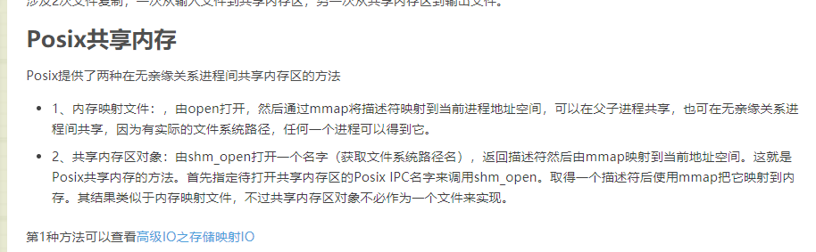

> 角声满天秋色里
>
> 塞上燕脂凝夜紫

之前有写过一篇文章 [mmap基本用法和共享内存](https://bbkgl.github.io/2020/03/23/mmap%E5%9F%BA%E6%9C%AC%E7%94%A8%E6%B3%95%E5%92%8C%E5%85%B1%E4%BA%AB%E5%86%85%E5%AD%98/)，讲了通过mmap使用共享内存的基本操作，但是对共享内存原理（sys v, posix）基本没怎么介绍，这里当是自己学习，好好深挖一波。

最难受的是之前面过一次wxg二面，面了三个小时（确实是3小时。。。我这么菜完全不值得3小时），面试官当时问了我共享内存（System v, POSIX）两种实现原理有什么区别。听完问题就觉得完了，我连sys v，posix是什么都不知道，偶尔听到过，但完全没去查过，更别说 unix 接口的不同标准的实现了。

为了避免太尴尬，我说这个问题可以理解成共享内存的两套API "shmat/mmap" 之间的区别吗？面试官说可以。于是又胡扯了一堆，什么`/dev/shm`，虚拟文件系统，swap分区都扯上了。最后不出意外地地被挂了，现在想想还不如直接只把自己知道的列一下，而不是胡扯。。。

这篇文章 [mmap基本用法和共享内存](https://bbkgl.github.io/2020/03/23/mmap%E5%9F%BA%E6%9C%AC%E7%94%A8%E6%B3%95%E5%92%8C%E5%85%B1%E4%BA%AB%E5%86%85%E5%AD%98/) 是我面试前写的，感觉面试官应该是看了我博客以后，有意问的。

## 前言

> 部分参考 [宋宝华：世上最好的共享内存](https://blog.csdn.net/21cnbao/article/details/102994278)

既然是写文章，肯定存在资料搜集的过程，这个过程会阅读很多其他人的相关文章。。。阅读后，真的被很多抄来抄去的文章恶心到了，抄就算了，还抄个错的。。。

Linux中存在两种共享内存 (Shared Memory)机制： 

**System V shared memory(shmget/shmat/shmdt)**

- Original shared memory mechanism, still widely used
- Sharing between unrelated processes

 **POSIX shared memory(shm_open/shm_unlink)**

- Sharing between unrelated processes, without overhead of filesystem I/O
- Intended to be simpler and better than older APIs

还有一种就是内存映射/文件映射，也是用mmap，不知道属不属于 **POSIX**。

有的文章把 "内存映射/文件映射" 算进 **POSIX** 共享内存。。。有的不算，不过我认为不算，毕竟其映射的文件不在 `/dev/shm` 下。

**Shared mappings – mmap(2) **

- Shared anonymous mappings：Sharing between related processes only (related via fork())
- Shared file mappings：Sharing between unrelated processes, backed by file in filesystem